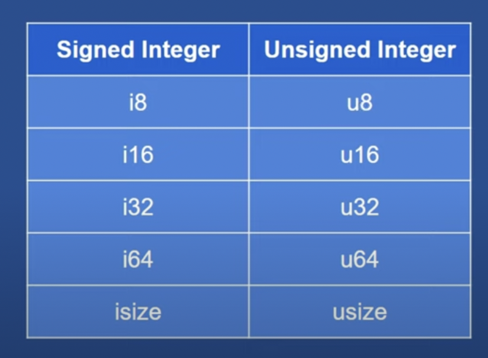
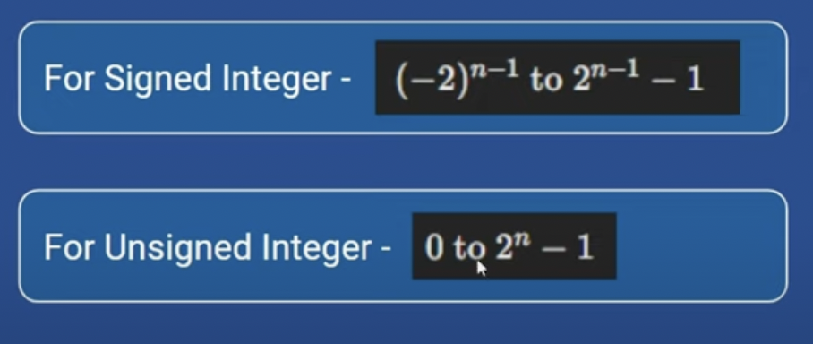
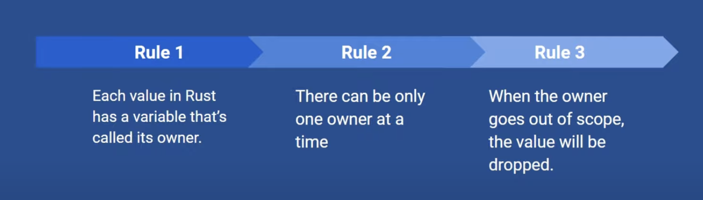
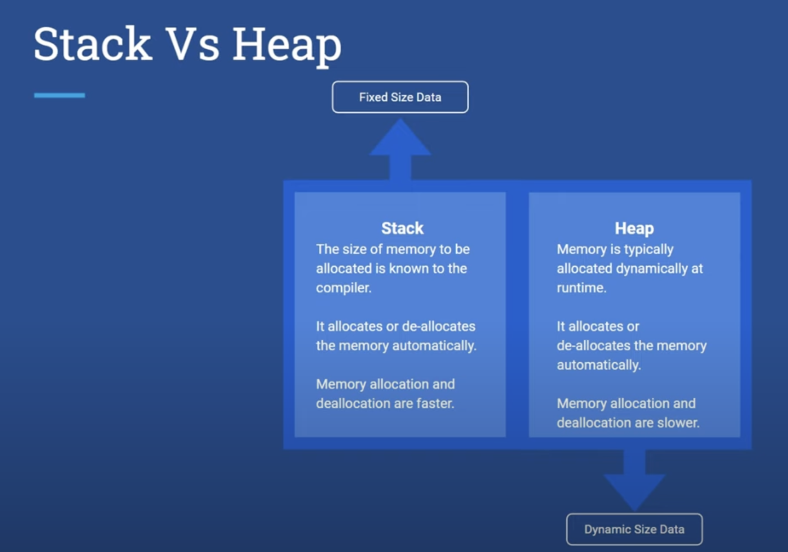
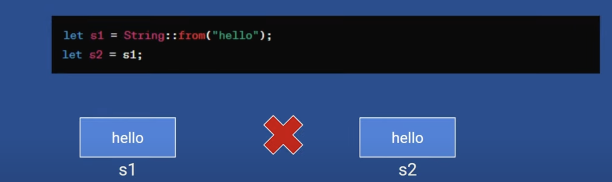

## main function

- main function is the entry point for a rust program.
- `cargo build` builds code into machine executable code. executable is generated into target folder then into debug folder.
- `cargo run` builds and executes code.
- As we not making our code production ready we are just testing it so it is building an un optimized version in the debug folder.
- `cargo build --release` builds optimized production ready application.

## data type

- u8 means unsigned integer in 8 bits.
- type inference works in primitive data types.

## Immutable data type

- By default all data types are immutable in Rust.

## Mutable data types

- By adding keyword `mut` variable can be made mutable.

## Ownership

- Ownership is a set of rules that govern how a Rust program manages memory.
- Ownership is Rust's most unique feature and it enables Rust to make memory safety guarantees without needing a garbage collector.

## Rust approach

In the above example stack is used

But in above heap is used.
