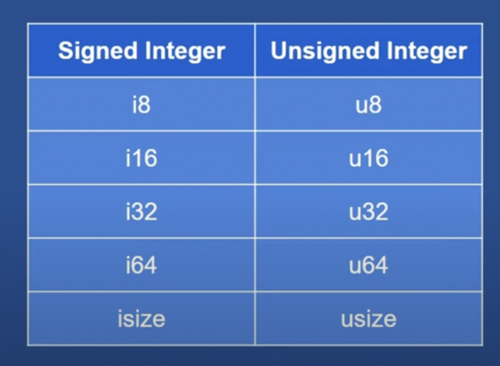
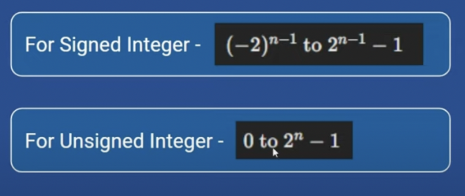
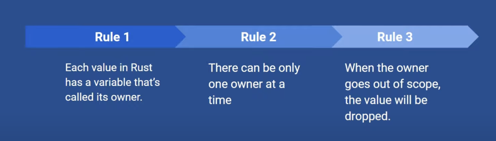
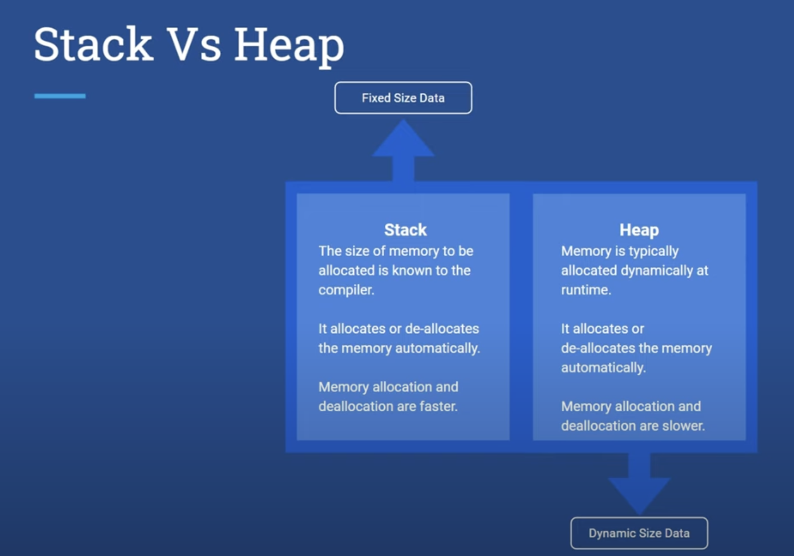
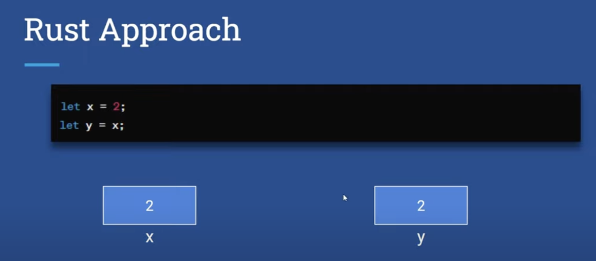
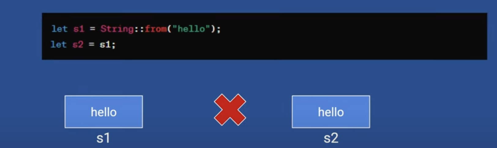
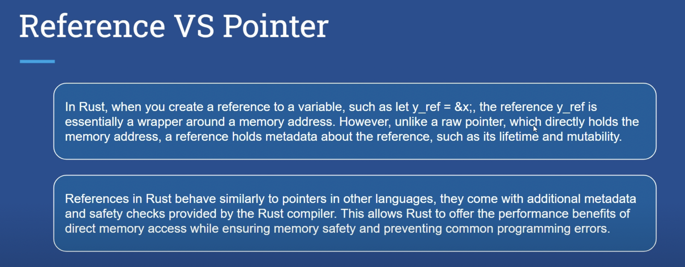

## Rust

- Rust is a system programming language. System programming languages are those programming languages through which hardware can be accessed easily.

## To create a new program

- `cargo run hello_program`  

## fn means function

- function name starts with `fn`

## Rust requires lines to be ended with semicolon

## Cargo is the package manager

## Casing

- Rust follows SnakeCase while javascript follows CamelCase. As soon as we start using camelcase rust will start throwing warning. All folders and files needs to be named according to snakecase.

## main function

- main function is the entry point for a rust program.

## cargo

- `cargo build` builds or compiles code into machine executable code. executable is generated into target/debug folder.
- `cargo run` builds and executes code. It might skip compiling if no changes have been in the code.
- As we not making our code production ready we are just testing it so it is building an un optimized version in the debug folder.
- `cargo build --release` builds optimized production ready application.

## Cargo.lock

- Similar like package.json here dependencies version are locked.

## data type

- u8 means unsigned integer in 8 bits.
- unsigned will contain only positive values but signed will have both negative and positive values
- type inference works in primitive data types but not in complex data types.

## Formatted string

- `println!("this is stored in num2: {}", num2);`

## Immutable data type

- By default all data types are immutable in Rust.

## Mutable data types

- By adding keyword `mut` variable can be made mutable.

## Ownership

- Ownership is a set of rules that govern how a Rust program manages memory.
- Ownership is Rust's most unique feature and it enables Rust to make memory safety guarantees without needing a garbage collector.

## Rust approach

In the above example stack is used. In case of `y=2` new memory y is created.

But in above heap is used.

## Avoiding ownership

- clone method is used for deep copy of heap data. This is an expensive method.

## Borrowing ownership

- &s1 syntax lets us creates a reference that refers to the value of s1 but does not own it.
- s3 = &s . Here s3 is a & reference. So the data it refers to can not be borrowed as mutable.

## Reference rules

- Multiple read operations are fine.
- Multiple write-write operations and read-write operations needs to be performed synchronously.

## Reference vs pointer

## character type

- A char in Rust is always 4 bytes in size and can represent characters from various languages, including ASCII characters, emojis and characters from non-latin scripts.

## array type

- An array is a collection of homogenous elements. Meaning collection of only 1 type of elements.

## pass_array_to_function2

- We can pass array to function in 2 ways. One by value and other by reference.

## Vector dynamic array

- Array is stack based data where we were already aware of its size at the compile time. But Vector is a heap allocated data

## Type inference

- Type inference is a feature in programming languages that allows the compiler to deduce the data type of a variable or expression without explicit type annotations from the programmer.
