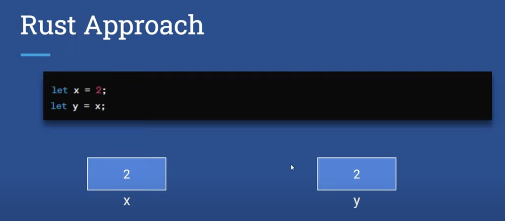
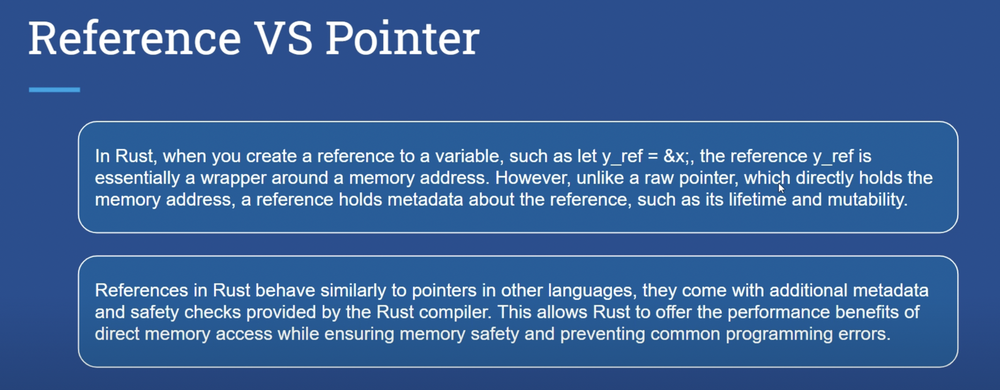

## main function

- main function is the entry point for a rust program.
- `cargo build` builds code into machine executable code. executable is generated into target folder then into debug folder.
- `cargo run` builds and executes code.
- As we not making our code production ready we are just testing it so it is building an un optimized version in the debug folder.
- `cargo build --release` builds optimized production ready application.

## data type

- u8 means unsigned integer in 8 bits.
- type inference works in primitive data types.

## Immutable data type

- By default all data types are immutable in Rust.

## Mutable data types

- By adding keyword `mut` variable can be made mutable.

## Ownership

- Ownership is a set of rules that govern how a Rust program manages memory.
- Ownership is Rust's most unique feature and it enables Rust to make memory safety guarantees without needing a garbage collector.

## Rust approach

In the above example stack is used

But in above heap is used.

## Avoiding ownership

- clone method is used for deep copy of heap data. This is an expensive method.

## Borrowing ownership

- &s1 syntax lets us creates a reference that refers to the value of s1 but does not own it.
- s3 = &s . Here s3 is a & reference. So the data it refers to can not be borrowed as mutable.

## Reference rules

- Multiple read operations are fine.
- Multiple write-write operations and read-write operations needs to be performed synchronously.

## Reference vs pointer

## character type

- A char in Rust is always 4 bytes in size and can represent characters from various languages, including ASCII characters, emojis and characters from non-latin scripts.

## array type
